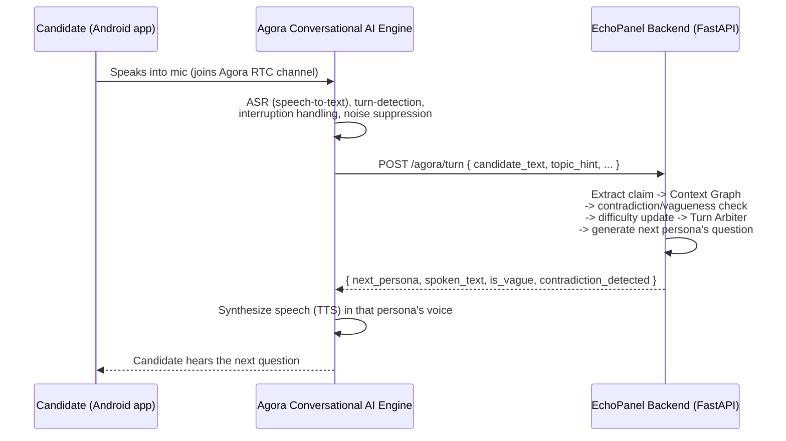

# EchoPanel — Architecture & Walkthrough

This document explains *how the whole system works*, end to end — not just
how to run it (see `README.md` for that). Read this if you want to
understand why each piece exists, how a single interview turn actually
flows through the code, and where the seams are for extending it.

---

## 1. The problem this is solving

A real hiring panel has several interviewers in the room. Each one has a
different lens — a technical interviewer cares about correctness, a product
manager cares about business impact, a hiring manager is trying to form an
overall hire/no-hire read. Crucially, **they react to each other**: if a
candidate gives a technically sound answer but skips over customer impact,
the technical interviewer might accept it — but the product interviewer
should independently push back, because acceptance by one role doesn't mean
acceptance by all.

A single chatbot interviewer can't do this. It has one voice, one rubric,
and no mechanism to "notice" that a claim went unchallenged by a different
kind of scrutiny. EchoPanel's entire design exists to solve that one
problem: **give several distinct interviewer personas a shared memory of
what's been claimed and challenged, and a mechanism to decide who should
speak next based on that shared memory** — without any of them needing to
re-read the whole conversation transcript to figure out what's going on.

Everything else (voice, transcription, difficulty scaling, the final
report) is important, but it's in service of that one core idea.

---

## 2. The three systems involved, and who owns what



Three systems, three jobs, and it's important not to blur them:

- **Agora's Conversational AI Engine** owns everything about *sound*: real-time
  audio transport (their SDRTN® network), speech-to-text, detecting when the
  candidate has finished talking (turn-detection), letting the candidate
  interrupt a persona mid-sentence (barge-in), and text-to-speech. **We do
  not reimplement any of this.** It's a paid, hosted capability we call into.
- **The EchoPanel backend** owns everything about *reasoning*: whose turn it
  is, what each persona should say, whether an answer was vague or
  contradicts something said earlier, how difficulty should adapt, and how to
  score the whole interview at the end. It has no idea what a WAV file looks
  like — it only ever sees and produces text.
- **The Android app** owns the *candidate-facing experience*: joining the
  Agora voice channel, showing the AI-disclosure banner and consent dialog
  (a hard legal/ethical requirement, not a nice-to-have), rendering the
  live transcript, and showing the final report once the interview ends.

If you're extending this project, the first question to ask is "which of
these three systems does this belong to?" — most bugs in a project like
this come from blurring that line (e.g. trying to do ASR client-side, or
putting scoring logic in the Android app).

---

## 3. The backend, piece by piece

All backend code lives under `backend/app/`. Here's what each piece does
and *why* it's shaped the way it is.

### 3.1 The Context Graph (`app/models/schemas.py`)

This is the single most important data structure in the whole project.

```python
class ClaimNode(BaseModel):
    id: UUID
    topic: str
    claim: str
    confidence: float          # how concrete/specific the answer was
    raised_by: PersonaRole     # which persona was asking when this came up
    transcript_timestamp_ms: int
    contradicts: list[UUID]    # other claims this one conflicts with
    is_vague: bool

class ContextGraph(BaseModel):
    session_id: UUID
    nodes: list[ClaimNode]
```

Every time the candidate answers a question, their answer is distilled into
one `ClaimNode` — not stored as raw text, but as a **structured claim**:
what topic it's about, what was claimed, how confident/specific it was, and
who was asking. This node gets appended to the graph and never removed
(append-only).

**Why not just re-read the transcript?** Two reasons:

1. *Cost and latency.* Feeding the entire growing transcript into an LLM
   call for every single turn gets slower and more expensive as the
   interview goes on. The graph is a compressed, structured summary that
   stays cheap to query no matter how long the interview runs.
2. *This is what actually enables cross-persona coordination.* When the
   Product interviewer wants to know "has anyone made a claim about
   customer impact that I should challenge?", they ask
   `graph.nodes_for_topic("checkout redesign")` and get back exactly the
   claims relevant to that decision — including who raised them and
   whether anyone already contradicted them. A raw transcript can't answer
   that question directly; an LLM would have to re-derive it every time.

### 3.2 Claim extraction and the vagueness/contradiction check

Files: `personas/engine.py`, `services/contradiction_detector.py`

When the candidate's answer text arrives, the first thing that happens is
`extract_claim()` — an OpenAI call that turns free-text speech into a
structured `ClaimNode` (topic, claim, confidence). This is the translation
layer between "what a human said" and "what the graph can reason about."

Immediately after that, **before any scoring happens**, `process_new_claim()`
runs two checks against the graph:

- **Vagueness**: is `confidence` below a threshold (default `0.4`,
  configurable via `VAGUENESS_CONFIDENCE_THRESHOLD`)? If so, the claim is
  flagged `is_vague = True`.
- **Contradiction**: does this claim conflict with an earlier claim on the
  *same topic*? The prototype uses a lightweight heuristic — checking for
  negation markers ("not", "never", "isn't"...) and flagging a conflict
  when polarity differs between two same-topic claims. This is explicitly
  a stand-in for a real NLI (natural language inference) model — the
  interface (`find_contradictions(new_claim, graph) -> list[ClaimNode]`)
  is designed so you can swap the implementation without touching any
  caller.

The order matters: flagging happens *before* the difficulty controller
scores the answer, so a vague or contradictory answer feeds into the next
step honestly rather than being scored first and flagged as an afterthought.

### 3.3 The difficulty controller (`services/difficulty_controller.py`)

Each topic has a **rolling competence score** — a weighted average that
leans 70% on history and 30% on the newest observation
(`_ROLLING_WEIGHT = 0.3`), so one lucky or unlucky answer doesn't swing the
difficulty wildly. That score maps to a three-rung ladder:

```
RECALL  ->  APPLIED  ->  EDGE_CASE
```

Score above `0.7` promotes the next question on that topic up a rung;
below `0.35` demotes it. This score is threaded into the persona's prompt
(`generate_followup(..., question_depth=...)`) so the LLM is explicitly
told what depth to probe at — the candidate doesn't just get harder
questions in the abstract, the *shape* of the question changes (a recall
question vs. an edge-case scenario question).

### 3.4 The Turn Arbiter (`services/turn_arbiter.py`) — the heart of the system

This is where the "product interviewer independently challenges the
technical interviewer's accepted answer" behavior actually lives. Every
active persona computes an **interest score** (0-1) for claiming the next
turn, and the arbiter picks the highest bidder.

Four out of five personas use the same topic-affinity logic:

```python
_PERSONA_TOPIC_AFFINITY = {
    PersonaRole.TECHNICAL: ("architecture", "algorithm", "code", ...),
    PersonaRole.PRODUCT_BUSINESS: ("customer", "revenue", "impact", ...),
    PersonaRole.BEHAVIOURAL: ("conflict", "team", "leadership", ...),
    PersonaRole.CUSTOMER: ("user", "experience", "support", ...),
}
```

Base interest is `0.2`. If the latest topic's text matches this persona's
affinity keywords, `+0.5`. And critically:

```python
unchallenged = [
    n for n in topic_nodes if n.raised_by != persona and not n.contradicts
]
if unchallenged:
    base += 0.25
```

**This is the exact mechanism behind the example scenario.** If the
Technical interviewer raised a claim about "checkout service redesign" and
nobody has contradicted it yet, the Product interviewer — who has topic
affinity on "customer"/"impact" — sees an unchallenged claim on a topic
they care about and gets a `+0.25` boost, pushing their score above
Technical's and winning them the next turn. There's a dedicated test for
exactly this: `test_example_scenario_product_challenges_unchallenged_technical_claim`
in `backend/tests/test_services.py`.

**The Hiring Manager is deliberately different.** Rather than chasing topic
keywords, their interest rises as *more distinct personas have spoken* and
especially when *contradictions exist to synthesize*:

```python
base = 0.15 + 0.15 * len(others_who_spoke)
if contested_nodes:
    base += 0.3
```

This models a real hiring manager's role: they're not trying to
out-compete the specialists on their own turf, they're waiting for enough
signal to accumulate before stepping in to synthesize a hire/no-hire read
across everything that's been said.

### 3.5 Personas (`personas/base.py`, `personas/engine.py`)

Each of the five personas (`TECHNICAL`, `PRODUCT_BUSINESS`, `BEHAVIOURAL`,
`CUSTOMER`, `HIRING_MANAGER`) is defined by a `PersonaDefinition`: a rubric
(what they're scoring) and a system prompt (how they should behave,
explicitly told what *not* to evaluate — e.g. the Technical interviewer is
told not to weigh in on business impact, since that's the Product
interviewer's job). This separation of concerns in the prompts is what
keeps personas from converging into one generic voice.

`generate_followup()` builds the actual LLM call: it serializes the
relevant slice of the Context Graph (not the transcript) into the prompt
alongside the persona's rubric and the target question depth, and asks for
a short, spoken-register question or challenge.

### 3.6 The report generator (`services/report_generator.py`)

At the end of a session, `generate_final_report()` walks every topic that
has a competence score, finds the most recent claim on that topic as the
"anchor," and produces a `VerdictItem` that links a score and verdict text
back to a specific `supporting_claim_id` and `transcript_timestamp_ms`.
**Nothing in the final report is a free-floating number** — every score
can be traced back to the exact moment in the interview that justified it.
This is the "evidence-based feedback linked to the transcript" requirement,
made structurally impossible to skip rather than just a style guideline.

### 3.7 The API surface (`api/sessions.py`, `api/agora_hooks.py`)

Two route groups:

- **`/sessions`** — ordinary REST lifecycle: create a session (with
  candidate name + which personas are active), log consent, fetch the
  session, fetch the final report. This is what the Android app calls
  directly.
- **`/agora`** — the tool-calling hooks *Agora itself* invokes mid-call:
  - `POST /agora/turn` is the one endpoint that does all the real work —
    it's the single function that chains together claim extraction ->
    contradiction check -> difficulty update -> turn arbitration ->
    follow-up generation, and returns exactly what Agora needs to speak next.
  - `POST /agora/greeting` returns the spoken AI-disclosure statement that
    plays before the interview starts, wired to Agora's automated-greeting
    hook.

### 3.8 Storage (`services/context_graph_store.py`)

Sessions live in a process-wide in-memory singleton
(`ContextGraphStore`). This is intentional for a prototype — it keeps the
system trivially easy to reason about and test — but it means **state is
lost on restart and won't work across multiple backend instances**. The
class is written as a narrow interface specifically so it can be swapped
for a Redis- or Postgres-backed implementation without touching any
caller; that's the first thing to change before any real deployment.

---

## 4. One full turn, traced start to finish

Concretely, here's everything that happens between the candidate finishing
a sentence and hearing the next question, in the order it happens in
`api/agora_hooks.py::handle_turn`:

1. **Agora transcribes** the candidate's speech and calls
   `POST /agora/turn` with the recognized text, a topic hint, a timestamp,
   and which persona asked the question being answered.
2. **`extract_claim()`** — an OpenAI call — turns that raw text into a
   structured `ClaimNode` (topic, claim, confidence).
3. **`process_new_claim()`** checks the new claim against the graph for
   vagueness (confidence below threshold) and contradictions (opposite
   polarity on the same topic as an earlier claim), then the claim is
   appended to the graph.
4. **`update_competence()`** folds this claim's confidence into the
   topic's rolling competence score and recalculates the next question
   depth (recall/applied/edge_case).
5. **`compute_interest_scores()`** asks every active persona how much they
   want the next turn, given the latest topic and the current graph state
   (including whether anyone's claim on this topic is sitting
   unchallenged).
6. **`pick_next_persona()`** picks the highest bidder.
7. **`generate_followup()`** — another OpenAI call — generates that
   winning persona's actual next question, grounded in the relevant slice
   of the graph and told what depth to probe at.
8. The backend returns `{ next_persona, spoken_text, is_vague,
   contradiction_detected }`. Agora speaks `spoken_text` in that persona's
   voice; the Android app appends both the candidate's answer and the new
   question to the on-screen transcript.

Every one of those eight steps is a separately testable, separately
replaceable unit — that's a deliberate design choice, not an accident of
how the code was written.

---

## 5. The Android app, piece by piece

The Android app follows **Clean Architecture**: dependencies point inward
(`presentation` depends on `domain`, `data` depends on `domain`, but
`domain` depends on nothing Android-specific). This means the business
logic — what a persona is, what a turn result looks like — could be tested
or reused without Android at all.

```
domain/          Pure Kotlin. No Android imports, no networking types.
  model/           InterviewSession, PersonaRole, TurnResult, CallState...
  repository/      Interfaces only: InterviewRepository, AgoraCallRepository
  usecase/         One class per user action (StartInterviewSessionUseCase, ...)

data/            Implements the domain interfaces using real frameworks.
  remote/dto/      Wire-format classes matching the backend's JSON exactly
  remote/api/      Retrofit interface -- the actual HTTP calls
  repository/      Maps DTOs <-> domain models; implements InterviewRepository
  agora/           Wraps Agora's RTC engine; implements AgoraCallRepository

presentation/    Compose UI + ViewModels. Depends on domain, never on data directly.
  interview/       Live interview screen + its ViewModel
  report/          Final report screen + its ViewModel
  disclosure/      The AI-disclosure banner and consent dialog
  common/theme/    Material3 theme

di/              Hilt modules wiring data implementations to domain interfaces.
```

**Why bother with this many layers for a hackathon app?** Two concrete
payoffs already visible in this codebase:

- The `InterviewViewModel` never imports Retrofit, OkHttp, or anything
  networking-specific — it only calls use cases, which only see the
  `InterviewRepository` *interface*. You could swap the entire networking
  stack (or point it at a fake for testing) without touching a single line
  of UI or ViewModel code.
- The DTOs (`data/remote/dto/InterviewDtos.kt`) are kept deliberately
  separate from the domain models (`domain/model/InterviewModels.kt`), with
  explicit mapper functions (`toDomain()` / `toDto()`) in
  `InterviewRepositoryImpl`. When the backend's JSON shape changes, only
  the DTO and the mapper need to change — the rest of the app is
  insulated.

### 5.1 The interview screen flow

`InterviewViewModel` holds a single `InterviewUiState` (session ID, call
state, transcript, whether the consent dialog is showing, current
speaking persona). The sequence:

1. `startSession()` calls the backend to create a session, then shows the
   consent dialog (`showConsentDialog = true` by default).
2. `onConsentGiven()` logs consent server-side, then calls
   `joinVoiceCall()`, which hands off to `AgoraCallRepository.joinCall()`
   to actually join the Agora RTC channel.
3. As Agora's ASR produces recognized speech (or, during development
   without a live Agora channel, via a manual text-input fallback),
   `onCandidateAnswer()` fires: it appends the candidate's turn to the
   transcript, calls `submitCandidateTurn()` (which hits
   `POST /agora/turn`), and appends the returned persona's response to the
   transcript too.
4. `AiDisclosureBanner` is rendered as the screen's persistent top bar for
   the *entire* interview — not just shown once at the start — because the
   requirement is that the candidate always knows they're talking to an
   AI, not just at t=0.

### 5.2 What's real vs. what's a seam waiting to be filled

`AgoraCallRepositoryImpl.observeRecognizedSpeech()` currently returns an
empty `Flow` — this is the one place in the whole client where real
integration work remains. Agora's Conversational AI SDK (distinct from the
base RTC SDK already wired in `build.gradle.kts`) delivers ASR transcripts
through its own event/data-stream channel once configured in the Agora
console; that callback needs to be wired into this `Flow` once you have an
Agora account and app credentials. Everything downstream of that Flow —
the ViewModel, the use cases, the backend call — is already built and
tested against the shape of the data it'll produce.

---

## 6. Design decisions worth understanding (and their trade-offs)

| Decision | Why | Trade-off accepted |
|---|---|---|
| Context Graph instead of re-reading transcript | Cheap, structured, enables cross-persona reasoning | Claim extraction is lossy — nuance not captured in `{topic, claim, confidence}` is gone |
| Contradiction detection via keyword heuristic | Zero-dependency, fast, easy to test | Will miss semantic contradictions that don't use negation words; swap for a real NLI model before relying on this in production |
| In-memory session store | Simplest possible thing that works for a demo | No persistence across restarts, no multi-instance support |
| Turn Arbiter uses hand-tuned score deltas (+0.5, +0.25, ...) | Transparent, debuggable, deterministic given the same graph state | Not learned — a real system might train these weights or replace the heuristic with an LLM call that reasons about interest more richly |
| Personas are separate prompts, not one prompt with role-switching | Keeps each persona's voice and rubric genuinely distinct, avoids one prompt trying to do five jobs | Five times the LLM calls if all personas were asked to react to every turn (mitigated by the arbiter only calling the winner) |
| Android talks to backend over plain REST + a separate Agora RTC connection | Simple to reason about, each concern isolated | Two separate connections to manage/monitor client-side instead of one unified channel |

---

## 7. Where to look when you want to change something

- **"I want to add a 6th persona"** → `backend/app/personas/base.py` (add a
  `PersonaDefinition`), `backend/app/services/turn_arbiter.py` (add
  affinity keywords or custom interest logic), `backend/app/models/schemas.py`
  (add to the `PersonaRole` enum), then mirror the same enum value in
  `android/.../domain/model/InterviewModels.kt`,
  `android/.../data/remote/dto/InterviewDtos.kt`, and the two `when`
  mappers in `InterviewRepositoryImpl.kt`.
- **"I want smarter contradiction detection"** → replace the body of
  `find_contradictions()` in `backend/app/services/contradiction_detector.py`
  with a real NLI model call; the function signature is already the
  correct shape for a drop-in swap.
- **"I want sessions to survive a restart"** → replace
  `ContextGraphStore`'s internal `dict` in
  `backend/app/services/context_graph_store.py` with a Redis or Postgres
  backend; every other file depends only on the class's public methods.
- **"I want to wire up real Agora voice"** → get Agora console credentials,
  add the Conversational AI SDK module (beyond the base RTC SDK already in
  `android/app/build.gradle.kts`), and implement the callback inside
  `observeRecognizedSpeech()` in `AgoraCallRepositoryImpl.kt`.
- **"I want to see the exact behavior the panel is supposed to have"** →
  read `backend/tests/test_services.py` top to bottom. Every core behavior
  (vagueness flagging, contradiction detection, arbiter picking the
  highest bidder, competence promoting question depth, the PS11 example
  scenario, the Hiring Manager's synthesizing behavior) has a dedicated,
  passing test that doubles as executable documentation.

---

## 8. What's genuinely finished vs. what's a scaffold

Being direct about this matters more than it might seem, since it's easy
for a well-organized codebase to *look* more finished than it is:

**Fully implemented, tested, and runnable today** (no external credentials
needed beyond an OpenAI key): the Context Graph, contradiction/vagueness
detection, difficulty controller, Turn Arbiter (including the Hiring
Manager's distinct synthesis logic), all five persona prompts, the report
generator, and the full FastAPI route surface. `make test` runs 6 tests
covering all of this, including the exact example scenario from the
problem statement.

**Structurally complete but functionally a stub**: the Agora voice
integration. The Android app has a real `RtcEngine` wired up that can
actually join a channel, but `observeRecognizedSpeech()` — the function
that's supposed to hand recognized candidate speech to the rest of the
app — returns nothing yet, because that requires Agora's Conversational AI
SDK and console credentials neither of us has configured. Everything that
consumes that data (the ViewModel, the backend call, the transcript UI) is
built and tested against the *shape* that data will have, but the wire
hasn't been connected end to end with real audio.

**Not built at all**: authentication on backend endpoints, a persistent
datastore, and an Agora token-issuing endpoint (needed before joining a
secured Agora channel in anything beyond a local test app).

If you're presenting or evaluating this project, the honest one-line
summary is: **the reasoning system (the actual hard, novel part — the
multi-persona coordination) is real and tested; the voice plumbing around
it is scaffolded and waiting on Agora credentials to become real audio.**

---

## 9. If you want to extend this next

Roughly in the order they'd unblock a real, demoable end-to-end voice
interview:

1. **Wire Agora credentials** — create an app in the Agora console, add a
   `/agora/token` endpoint (Agora publishes a token-builder library for
   this), and fill in `AGORA_APP_ID` in `android/app/build.gradle.kts`.
2. **Connect `observeRecognizedSpeech()`** to Agora's actual ASR callback
   once you have their Conversational AI SDK module — that's the one
   remaining gap between "compiles and runs" and "you can actually talk to
   it."
3. **Swap `ContextGraphStore` for Redis** if you need sessions to survive a
   restart or run across more than one backend process.
4. **Add basic auth** — even a shared secret per session would close the
   most obvious gap before showing this to anyone outside your own
   machine.
